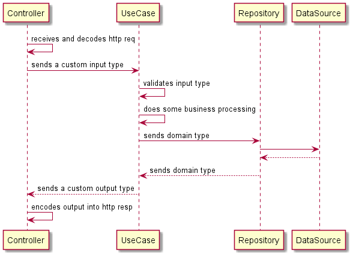

# Go Springfield Bank

Go Springfield Bank is a simple digital bank API.
It's main purpose is to transfer amounts between internal accounts.

Written in Golang, this project aims to follow Go best practices and [clean architecture](https://blog.cleancoder.com/uncle-bob/2012/08/13/the-clean-architecture.html) for best maintainability, extensibility and testability.

## Table of Contents
- [Main features](#features)
- [Demo / Deployment](#demo--deployment)
- [Running](#running)
- [Endpoints](#endpoints)
- [Development](#development)
- [Environment variables](#environment-variables)
- [References](#references)

## Features
- RESTful endpoints using [julienschmidt/httprouter](https://github.com/julienschmidt/httprouter)
- JWT-based authentication using [dgrijalva/jwt-go](https://github.com/dgrijalva/jwt-go)
- Postgres database connection pool using [jackc/pgx](https://github.com/jackc/pgx/v4)
- Database migration [golang-migrate/migrate](https://github.com/golang-migrate/migrate/v4)
- Environment variables configuration using [ilyakaznacheev/cleanenv](https://github.com/ilyakaznacheev/cleanenv)
- Structured logging with contextual information [zerolog](https://github.com/rs/zerolog)
- Error handling with proper http status code
- Idempotent requests
- Metrics/health endpoints with [heptiolabs/healthcheck](https://github.com/heptiolabs/healthcheck)
- OpenAPI/Swagger 2.0 documentation generated with [swaggo/swag](https://github.com/swaggo/swag)
- Integration tests with the help of [ory/dockertest](https://github.com/ory/dockertest/v3)

## Demo / Deployment
A Github Action is configured to compile, test, build a docker image and deploy to Heroku.

The application is accessible at https://go-springfield-bank.herokuapp.com/.

## Running
You can quickly build and run the application with its dependencies with this command (requires [docker-compose](https://docs.docker.com/compose/install/)):
> make start

You can stop it with:
> make stop

## Endpoints
The complete API documentations is available at `/swagger`.

Demo: https://go-springfield-bank.herokuapp.com/swagger

### Accounts
- `POST /accounts` - Create an account
    - accepts `X-Idempotent-Key` header
- `GET /accounts` - Fetch all the accounts
- `GET /accounts/:id/balance` - Get the balance of an account

### Authentication
- `POST /login` - Authenticate the user and return the access token

### Transfers
- `POST /transfers` - Transfer money to another account
    - requires `Authorization`
    - accepts `X-Idempotent-Key` header
- `GET /transfers` - Fetch all the transfers related to the logged in account
    -requires `Authorization`

### Metrics/Health
The monitoring endpoints listen on a different port for security reasons.
The monitoring port number can be changed using the `MONITORING_PORT` [environment variable](#environment-variables).
- `GET /metrics` - Prometheus metrics
- `GET /ready` - Readiness endpoint
- `GET /live` - Liveness endpoint

## Development
### Architecture and data flow
Here's a simple sequence diagram that shows the roles of Controllers, Use Cases and Repositories and how they interact with each other:

### Postgres and Redis servers
The application depends on Postgres and Redis servers.

You can get a Postgres and a Redis servers up and running quickly by running (requires [docker-compose](https://docs.docker.com/compose/install/)):
> make dev-up

You can shut them down later by running:
> make dev-down

### Setup
You can get the application dependencies by running (requires go 1.11+):
> make setup

### Tests
You can easily run the tests with:
> make test

## Environment variables
Check definitions and examples of configuration variables used by this app at [config/.env.example](config/.env.example).

## References
### Project layout
- https://github.com/golang-standards/project-layout

### Architecture
- https://blog.cleancoder.com/uncle-bob/2012/08/13/the-clean-architecture.html
- https://pusher.com/tutorials/clean-architecture-introduction
- https://dave.cheney.net/2016/08/20/solid-go-design
- https://medium.com/@jfeng45/go-micro-service-with-clean-architecture-application-layout-e6216dbb835a
- https://developpaper.com/go-microservices-with-clean-architecture-program-structure/
- https://medium.com/gdg-vit/clean-architecture-the-right-way-d83b81ecac6
- https://threedots.tech/post/ddd-cqrs-clean-architecture-combined/
- https://hackernoon.com/golang-clean-archithecture-efd6d7c43047

### Error handling
- https://medium.com/rungo/error-handling-in-go-f0125de052f0
- https://medium.com/spectro-cloud/decorating-go-error-d1db60bb9249

### Web server
- https://marcofranssen.nl/go-webserver-with-graceful-shutdown/
- https://getgophish.com/blog/post/2018-12-02-building-web-servers-in-go/

### Authentication and JWT
- https://dev.to/stevensunflash/a-working-solution-to-jwt-creation-and-invalidation-in-golang-4oe4
- https://learn.vonage.com/blog/2020/03/13/using-jwt-for-authentication-in-a-golang-application-dr/
- https://dev.to/omnisyle/simple-jwt-authentication-with-golang-part-3-1ja3
- https://codeburst.io/using-jwt-for-authentication-in-a-golang-application-e0357d579ce2
- https://hackernoon.com/creating-a-middleware-in-golang-for-jwt-based-authentication-cx3f32z8

### Tests
- https://dev.to/quii/learn-go-by-writing-tests-structs-methods-interfaces--table-driven-tests-1p01
- https://povilasv.me/go-advanced-testing-tips-tricks/
- https://dev.to/johndoe/integration-tests-with-dockertest-and-go-3eda
- https://www.ory.sh/dockertest-gaen-google-apple-exposure-notification-covid-19/
- https://blog.questionable.services/article/testing-http-handlers-go/
- https://medium.com/easyread/integration-test-database-in-golang-using-dockertest-59ed3b35240e
- https://jonnylangefeld.com/blog/how-to-write-a-go-api-part-3-testing-with-dockertest

### Best practices and tips
- https://github.com/golang/go/wiki/CodeReviewComments
- https://github.com/uber-go/guide/blob/master/style.md
- https://12factor.net/
- https://peter.bourgon.org/go-in-production/
- http://devs.cloudimmunity.com/gotchas-and-common-mistakes-in-go-golang/
- https://blog.learngoprogramming.com/gotchas-of-defer-in-go-1-8d070894cb01
- https://blog.learngoprogramming.com/5-gotchas-of-defer-in-go-golang-part-ii-cc550f6ad9aa
- https://blog.learngoprogramming.com/5-gotchas-of-defer-in-go-golang-part-iii-36a1ab3d6ef1
- https://blog.learngoprogramming.com/go-functions-overview-anonymous-closures-higher-order-deferred-concurrent-6799008dde7b

### Git
- https://www.conventionalcommits.org/en/v1.0.0/
- https://medium.com/desenvolvendo-com-paixao/otimize-seu-reposit%C3%B3rio-git-utilizando-o-arquivo-gitattributes-82a23517dcd0

### Idempotent requests
- https://stripe.com/docs/api/idempotent_requests
- https://ieftimov.com/post/understand-how-why-add-idempotent-requests-api/
- https://goenning.net/2017/03/18/server-side-cache-go/

## TODO
- [ ] integration test
- [ ] logout
